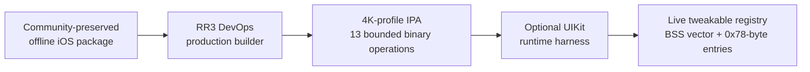

# RR3 DevOps

  <strong>Reverse Engineering and Runtime Developer Operations for Real Racing 3 — Final iOS Build</strong>

  
  
  
  
  

  <a href="docs/INSTALLATION.md">Deployment Guide</a> ·
  <a href="WORKFLOW.md">How It Was Built</a> ·
  <a href="overlay/README.md">Runtime Harness</a> ·
  <a href="docs/TECHNICAL_REPORT.md">Technical Report</a> ·
  <a href="docs/PROVENANCE.md">Provenance</a> ·
  <a href="docs/ANDROID_PORTING.md">Android Notes</a>

RR3 DevOps is a technical preservation and reverse-engineering project for the final iOS build of *Real Racing 3*. It provides a documented offline deployment path, a production-quality device profile, and a native runtime interface for the game's internal tweakable registry.

EA [delisted *Real Racing 3* on December 18, 2025 and closed its servers on March 19, 2026](https://forums.ea.com/discussions/other-ea-racing-games-en/real-racing-3---the-final-lap/13034060). RR3 DevOps builds on an existing community-preserved offline iOS package; it does not claim to have created that upstream offline workflow.

## Executive summary

The project has two technical components:

1. **Production package engineering** — an exact-build Python builder that applies a small, documented ARM64 patch set and injects an encrypted Engine Device Settings (EDS) profile for the final iOS binary.
2. **Runtime developer operations** — an injected Objective-C/UIKit harness that reads the game's live tweakable registry, categorizes entries, performs verified writes, captures a session baseline for reset, and records diagnostic output.

The central research contribution is the documented runtime data model: BSS vector location, `0x78`-byte entry layout, libc++ string decoding, type handling, and the live-value pointer used by the harness. To the best of the project's knowledge, this is the first public technical documentation and usable third-party interface for *Real Racing 3*'s internal runtime tweakable system.

**Validation boundary:** RR3 DevOps verifies that the harness reaches the researched runtime entries, writes the requested value through the live pointer, and reads it back. Selected controls were also confirmed on device with immediate visible changes. It does not claim that every registered entry has a visible effect in every scene: some values can be conditional, unused in the final build, or overridden later by higher-priority game logic.

## Architecture at a glance

| Surface | RR3 DevOps responsibility | Verification boundary |
|---|---|---|
| Offline deployment | Documents and redistributes the established local-cache workflow | Upstream preservation work; see [Provenance](docs/PROVENANCE.md) |
| Production package | Applies the final-build patch set and EDS profile | [Production patch specification](docs/BINARY_PATCHES.md) |
| Runtime operations | Presents and modifies live tweakable values through UIKit | [Internal developer systems](docs/INTERNAL_DEVELOPER_SYSTEMS.md) |
| Research transfer | Documents the method without claiming cross-platform addresses | [Android porting notes](docs/ANDROID_PORTING.md) |

## Scope and attribution

### Upstream community preservation work

The offline-capable iOS package, local cache-import mechanism, and asset cache existed before RR3 DevOps. The available public attribution credits Chinese user **有时会很闲** for the self-contained iOS package and **Flickxie** for the assets. Details and source links are maintained in [Provenance and credits](docs/PROVENANCE.md).

### RR3 DevOps contributions

- Production `build_4k_v3.py` patch builder and exact patch reference.
- Modified-RC4 EDS analysis and implementation.
- iPad Pro-derived modern-device EDS profile.
- Runtime analysis of developer flags and the tweakable registry.
- Reverse-engineered registry layout and live-value write path.
- UIKit developer harness with description mappings, read-back verification, session-baseline reset, and diagnostics.
- Platform-transfer documentation for independent Android research.

## Releases

| Release | Asset | Function |
|---|---|---|
| [v1.0-4k](https://github.com/Indegosblade/RR3-DevOps/releases/tag/v1.0-4k) | `RR3-DevOps-v1.0-Production-Quality.ipa` | Production quality profile: 120 FPS, ad suppression, known retired-endpoint rewrites, and custom EDS profile |
| [v1.0-overlay](https://github.com/Indegosblade/RR3-DevOps/releases/tag/v1.0-overlay) | `RR3-DevOps-v1.0-Developer-Harness.dylib` | Optional runtime developer harness |
| [v1.0-cache](https://github.com/Indegosblade/RR3-DevOps/releases/tag/v1.0-cache) | `RR3-DevOps-v1.0-Asset-Cache.zip` parts | Required asset cache for the documented local-play workflow |

The large assets remain GitHub Release attachments; the repository contains source code and technical documentation.

Download integrity: verify release assets against [SHA256SUMS.txt](SHA256SUMS.txt) before installation or cache reassembly.

## Compatibility

- **Confirmed RR3 DevOps test device:** iPhone 17 Pro (A19), iOS 26.0.
- **Harness deployment target:** iOS 15.0. This is a compiler target, not a universal compatibility claim.
- **Upstream package target class:** iPad and iPhone 12-or-newer, subject to asset-resolution compatibility and community verification.
- **Build specificity:** all offsets, virtual addresses, and runtime-layout findings apply to the final iOS binary examined by this project. They must be independently validated for another build or platform.

The “4K” release label identifies the elevated device profile. It does not claim a literal 3840×2160 framebuffer in every render path; see [EDS format and quality profile](docs/EDS_FORMAT.md).

## Technical documentation

| Document | Purpose |
|---|---|
| [Installation](docs/INSTALLATION.md) | Deployment and cache-import procedure |
| [Provenance and credits](docs/PROVENANCE.md) | Upstream attribution and redistribution boundary |
| [Technical report](docs/TECHNICAL_REPORT.md) | Methods, evidence, and validated findings |
| [How RR3 DevOps was built](WORKFLOW.md) | Plain-English account of the engineering workflow and hardware validation |
| [Production binary patches](docs/BINARY_PATCHES.md) | Authoritative `build_4k_v3.py` patch set |
| [EDS format and quality profile](docs/EDS_FORMAT.md) | Cipher analysis and configuration constraints |
| [Internal developer systems](docs/INTERNAL_DEVELOPER_SYSTEMS.md) | Runtime registry, counts, and developer-system status |
| [All runtime tweakables and research flags](docs/ALL_FLAGS.md) | Complete 887-description reference, grouped by overlay menu |
| [Android porting notes](docs/ANDROID_PORTING.md) | Platform-independent implementation guidance |
| [Troubleshooting](docs/TROUBLESHOOTING.md) | Reproducible diagnostic procedure |
| [Contributing](CONTRIBUTING.md) | Evidence and contribution standards |
| [Legal and rights](LEGAL.md) | Licensing, rights, and project boundary |

## Professional use and contributions

RR3 DevOps is provided as-is. The project does not offer a support SLA, but it does provide the source, technical references, diagnostics, and reporting standards required for reproducible community work. Compatibility reports, attribution corrections, verified technical findings, and focused pull requests are welcome through GitHub.

## Rights and license

Original RR3 DevOps source and documentation are available under the [MIT License](LICENSE). *Real Racing 3*, its executable, assets, and trademarks remain the property of their respective rights holders. RR3 DevOps is not affiliated with, endorsed by, or supported by Electronic Arts or Firemonkeys.
